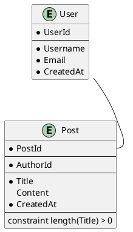

# schemagen

`schemagen` is a tool for generating database schemas and documentation from a simple, human-readable text format. It can output SQL `CREATE TABLE` statements and PlantUML diagrams.

## Usage

```bash
schemagen <command> <input_file>
```

-   `<command>`: The output format. Can be `sql`, `puml`, or `help`.
-   `<input_file>`: The path to the schema definition file.

### Examples

```bash
schemagen sql my_schema.schema > my_schema.sql
```

```bash
schemagen puml my_schema.schema > my_schema.puml
```

```bash
schemagen help
```
```

## Syntax

The schema is defined in a text file (e.g., `my_schema.schema`). The syntax is line-based.

### Entities

Entities are defined with a `*` followed by the entity name.

```
* MyEntity
```

### Primary Keys

Primary keys are defined with `PK` followed by the key name.

```
* MyEntity
  PK MyEntityId
```

### Attributes

Attributes are defined with a type code, a name, and an optional `!` for `NOT NULL`.

```
* MyEntity
  PK MyEntityId
  T MyTextField!
  I MyIntegerField
```

#### Attribute Types

| Code | SQL Type                               |
| :--- | :------------------------------------- |
| `T`  | `TEXT`                                 |
| `I`  | `INTEGER`                              |
| `F`  | `REAL`                                 |
| `L`  | `BOOLEAN`                              |
| `B`  | `BLOB`                                 |
| `TS` | `DATETIME DEFAULT current_timestamp` |

### Foreign Keys

Foreign keys are defined with `FK` followed by the key name and a reference to another entity's field. A `!` at the end of the name indicates `NOT NULL`.

```
* MyOtherEntity
  PK MyOtherEntityId

* MyEntity
  PK MyEntityId
  FK MyOtherEntityId! MyOtherEntity.MyOtherEntityId
```

### Unique Constraints

Unique constraints are defined with `U` followed by a list of field names.

```
* MyEntity
  PK MyEntityId
  T Field1
  T Field2
  U Field1 Field2
```

### Check Constraints

Check constraints are defined with `C` followed by an expression.

```
* MyEntity
  PK MyEntityId
  I MyField
  C (MyField > 0)
```

### Includes

You can include other schema files by listing the file paths in a file.

**`my_schema.schema`:**
```
my_entity.schema
my_other_entity.schema
```

**`my_entity.schema`:**
```
* MyEntity
  PK MyEntityId
```

**`my_other_entity.schema`:**
```
* MyOtherEntity
  PK MyOtherEntityId
```

## Example

**`my_schema.schema`:**
```
* User
  PK UserId
  T Username!
  T Email!
  TS CreatedAt

* Post
  PK PostId
  FK AuthorId! User.UserId
  T Title!
  T Content
  TS CreatedAt

  U Title
  C (length(Title) > 0)
```

### SQL Output

```sql
CREATE TABLE User (
  UserId INTEGER PRIMARY KEY AUTOINCREMENT,
  Username TEXT NOT NULL,
  Email TEXT NOT NULL,
  CreatedAt DATETIME DEFAULT current_timestamp
);
CREATE TABLE Post (
  PostId INTEGER PRIMARY KEY AUTOINCREMENT,
  AuthorId INTEGER NOT NULL,
  Title TEXT NOT NULL,
  Content TEXT,
  CreatedAt DATETIME DEFAULT current_timestamp,
  UNIQUE (Title),
  CHECK (length(Title) > 0)
);
```

### PlantUML Output


